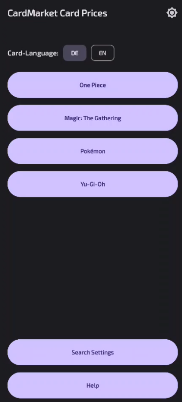
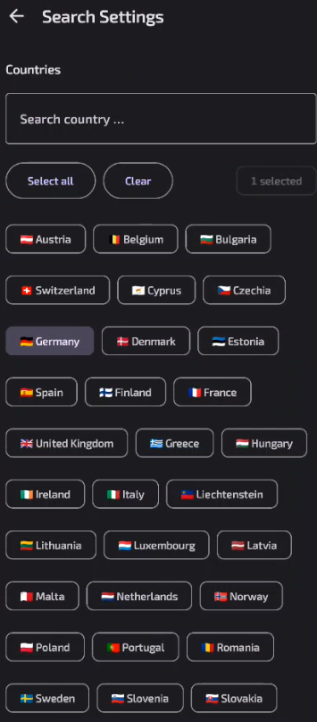
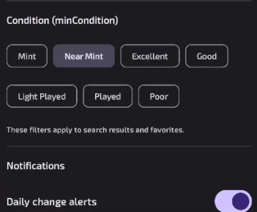
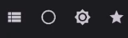
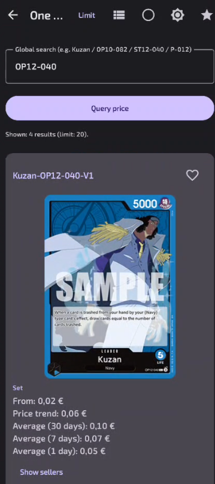
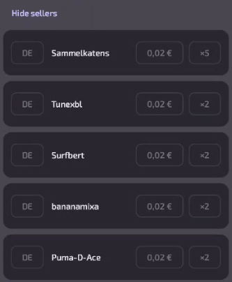
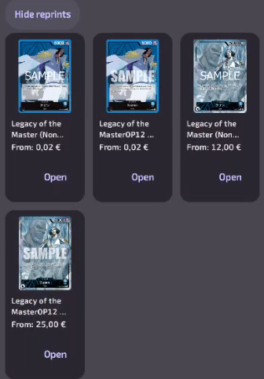

# CardMarket Card Prices (Android)

Find live Cardmarket prices for **One Piece**, **Pokémon**, **Magic: The Gathering**, and **Yu-Gi-Oh**.  
No account required. All data is fetched on-device.

> ⚠️ This repo distributes an **APK only**. You don’t need Android Studio or source code to use the app.

---

## Download & Install

1. **Download the APK** from the repository’s **Releases** page (the file ends with `.apk`).
2. On your Android device, open the APK and confirm the prompt to **Install**.  
   - If you’re blocked, enable *Install unknown apps* for your browser / file manager:  
     **Settings → Security → Install unknown apps** (wording may vary by device).
3. Launch **CardMarket Card Prices** from your app drawer.

> If Play Protect warns you, tap **Install anyway** (you can always uninstall from Settings).

---

## Quick Start

1. Choose a **card language** (DE / EN) at the top. 
   - (Currently only German and English , means for example you can search for the card names in English like "Drowzee" or in German like "Traumato")
2. Tap a game (One Piece, MTG, Pokémon, Yu-Gi-Oh).
3. Enter a name or code (e.g., `Kuzan`, `OP10-082`, `Unheilskauz`, `Kuriboh`) and tap **Query price**.
4. Scroll the results. Tap **Open** to view the product on Cardmarket.

---

## Features

### Search settings (filters)

- **Countries**: filter sellers by country (multi-select).
- **Condition (minCondition)**: set the lowest acceptable condition (Mint → Poor).  
- Filters apply to **search results** and **favorites refresh**. Saved locally on your device.

### Toolbar & layouts

- **View switcher** (left): cycles layout **Large → Compact → Grid**.
- **Exact search** (empty/checked circle):  
  - Off = broader fuzzy match  
  - On = only exact product matches
- **Search settings** (gear): open filters described above.
- **Favorites** (star): open your saved cards.

> Tip: The **Limit** chip in the top bar lets you change the per-page fetch limit.

### Result details

Each card shows:
- **Set name** and **image** (if available).
- **From price**, **Price trend**, **Average (30/7/1 days)**.
- **Show sellers**: expand to view a few cheapest offers  
  (seller name, country badge, price, quantity, no-tracking hint if detected).
- **Reprints**: tap **Show reprints** to load related printings (small tiles).  
  Each tile shows image, short title, starting price, and **Open**.

### Favorites

- Tap the heart on a result to **add/remove** from favorites.
- In **Favorites**, you can **refresh** items (respects your filters), **remove**, or **Open** on Cardmarket.
- Favorites are stored locally on your device.

### Cooldown / Rate limiting

If Cardmarket throttles too many requests, a small **Wait time** chip appears.  
You can still browse; search/“load more” waits until the timer clears automatically.

---

## Notes

- **Sample watermark**: Some official images on Cardmarket show *SAMPLE*. That watermark comes from the source and cannot be removed by the app. When Cardmarket serves clean images for specific printings, the app will display those instead.
- **Images in reprints**: Reprint images may appear after a short moment. A tiny progress bar is shown while loading. If a tile shows a broken-image icon, you can still tap **Open** to view it on Cardmarket.

---

## Privacy & Permissions

- **Network access only.** No analytics, no trackers.
- Your country/condition selections and favorites are stored **locally** on your device.
- This app is not affiliated with or endorsed by Cardmarket. All trademarks belong to their respective owners.

