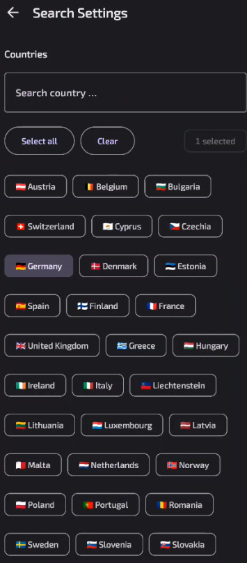
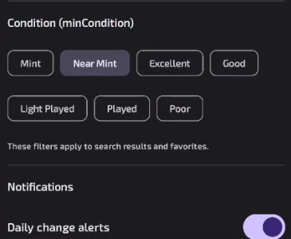
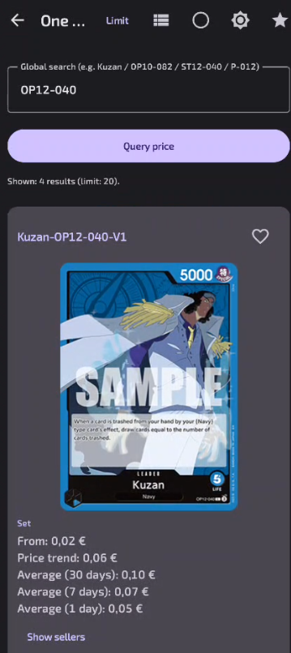
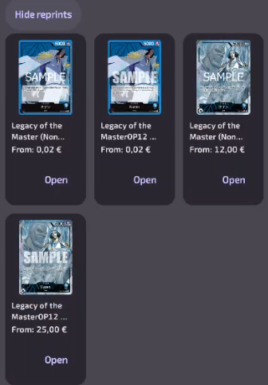

# CardMarket Card Prices (Android)

Lightweight app to look up prices, reprints, and sellers on **CardMarket** for:
**One Piece**, **Pokémon**, **Magic: The Gathering**, and **Yu-Gi-Oh!**

> Not affiliated with CardMarket. Use responsibly and follow CardMarket’s terms.

---

## Download & Install (APK)

1. **Download** the latest APK from the **Releases** page of this repository.
2. On your Android device, open the APK.
3. If prompted, enable **Install unknown apps** for your browser or file manager.
4. Tap **Install**.  
   *(No special permissions are required besides Internet access.)*

---

## How to Use

### 1) Home
- Choose the **card language** (DE / EN).
- Tap a game: **One Piece**, **Magic: The Gathering**, **Pokémon**, **Yu-Gi-Oh!**
- Open **Search Settings** to set:
  - **Countries** (seller locations to include)
  - **Condition** (**minCondition**; e.g., Near Mint)

### 2) Search
- Enter a **name or code** (examples: `Kuzan`, `OP10-082`, `ST12-040`, `P-012`).
- Tap **Query price**.
- The app shows a list of matches (limit shown at the top; you can change it).

### 3) Reading a Result
- **Set** name and the **price panel**:
  - **From** (starting price)
  - **Price trend**
  - **Average (30/7/1 days)**
- **Show/Hide sellers** to see cheapest offers (with country badges and quantities).
- **Show/Hide reprints** to see alternate printings in a compact 3-column grid.
- Tap **Open** on any card/reprint to view it directly on CardMarket.
- Tap the ⭐ icon to add/remove a card from **Favorites**.

### 4) Views & Controls
- **View switcher** (top bar): Large / Compact / Grid.
- **Limit** (top bar): change the number of results fetched.
- **Exact search** toggle (top bar).
- **Theme** toggle (top bar): light/dark.
- **Favorites** (top bar): browse your saved cards with refresh controls.

### 5) Cooldown
- To avoid CardMarket rate-limits, the app shows a small **cooldown chip** (“Wait time”).
- If you see it, simply wait until the counter reaches 0 and try again.

---

## Screenshots

| | | |
|---|---|---|
|  |  |  |
| *Home & language switch* | *Country filter* | *Minimum condition* |
|  |  |  |
| *Large result card* | *Reprints grid with images* | *Cheapest sellers* |

**File names to use**
- `home.png`
- `search-settings-countries.png`
- `search-settings-condition.png`
- `results-large.png`
- `reprints-grid.png`
- `sellers.png`

---

## Notes
- Filters (countries & condition) apply to **search results and favorites**.
- Images are loaded with the correct headers for CardMarket; if some don’t show, it’s usually due to rate-limiting—wait for the cooldown and retry.
- The app **does not collect personal data**; it only requests pages from CardMarket to display prices and images.

Enjoy!
